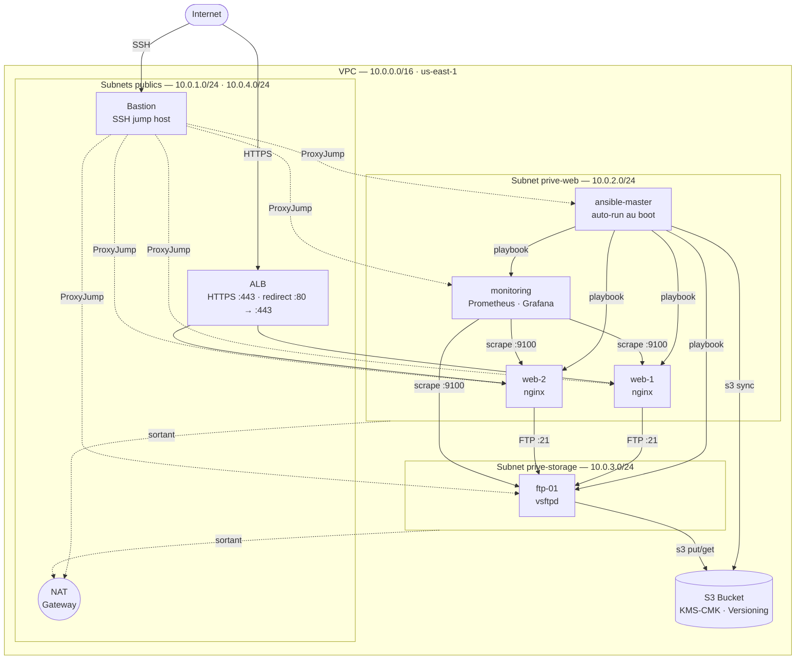

# Projet final — Infrastructure AWS automatisee & securisee (Terraform + Ansible)

**Equipe Team Rocket** — Mastere Cybersecurite 4A

---

## 1. Contexte

Infrastructure AWS 100 % automatisee (Terraform + Ansible), zero action manuelle apres `terraform apply`.
Le trafic web entre exclusivement par l'ALB HTTPS. L'acces SSH passe par le bastion.
L'Ansible master se configure seul au boot : il telecharge les playbooks depuis S3 et les applique.

---

## 2. Architecture deployee



### Composants

| Ressource        | Role                                      | Subnet           |
|------------------|-------------------------------------------|------------------|
| ALB              | Load balancer HTTPS internet-facing       | Public 1 + 2     |
| Bastion          | Jump host SSH (acces restreint a my_ip)   | Public 1         |
| web-1 / web-2    | nginx, page HTML deployee par Ansible     | Prive-web        |
| ansible-master   | Controller Ansible (auto-run au boot)     | Prive-web        |
| monitoring       | Prometheus + Grafana (acces via tunnel)   | Prive-web        |
| ftp-01           | vsftpd, stockage S3 chiffre KMS           | Prive-storage    |
| S3 bucket        | Stockage Ansible + archives FTP           | VPC Endpoint     |

---

## 3. Prerequis AWS Academy

1. **Start Lab** (voyant vert), puis coller les identifiants dans `~/.aws/credentials` :
   AWS Details -> AWS CLI -> Show

2. Contraintes du lab :
   - Region : `us-east-1`
   - Instances : `t3.micro`
   - AMI : Amazon Linux 2023
   - Profil IAM : `LabInstanceProfile` (pas de creation de roles IAM)

3. Les identifiants expirent a l'arret du lab — reactualiser apres chaque **Start Lab**.

---

## 4. Deploiement

### 4.1 Preparation (une seule fois)

```bash
# Renseigner votre IP publique dans terraform/terraform.tfvars
# my_ip = "X.X.X.X/32"

cd terraform
terraform init
```

### 4.2 Deploiement complet

```bash
cd terraform
terraform apply
```

Terraform effectue dans l'ordre :
1. VPC, subnets, NAT Gateway, route tables
2. Bastion, webs, FTP, monitoring (instances EC2)
3. S3 bucket (KMS) + upload de tous les fichiers Ansible
4. Ansible master (cree apres les objets S3 grace au `depends_on`)

Au boot, l'Ansible master :
- Telecharge les playbooks depuis S3 (`aws s3 sync`)
- Attend 120 s que les cibles soient disponibles
- Lance `ansible-playbook site.yml --extra-vars "@extra_vars.yml"`

**Duree totale estimee : 10 a 15 minutes selon le poste de travail**

### 4.3 Recuperer les IPs apres le apply

```bash
terraform output
```

Sorties utiles : `bastion_public_ip`, `alb_dns_name`, `ansible_master_private_ip`, `monitoring_private_ip`.

---

## 5. Acces et operations

### Preparer la cle SSH (Windows / WSL / Git Bash)

```bash
cp ansible/tpfinal.pem /tmp/tpfinal.pem && chmod 600 /tmp/tpfinal.pem
```

### Se connecter a l'Ansible master via le bastion

Remplacer `<BASTION_PUBLIC_IP>` et `<ANSIBLE_MASTER_PRIVATE_IP>` par les valeurs de `terraform output`.

```bash
ssh -i /tmp/tpfinal.pem \
  -o "ProxyCommand ssh -i /tmp/tpfinal.pem -W %h:%p ec2-user@<BASTION_PUBLIC_IP>" \
  ec2-user@<ANSIBLE_MASTER_PRIVATE_IP>
```

### Suivre le bootstrap Ansible (une fois connecte a l'Ansible master)

```bash
tail -f /var/log/ansible-bootstrap.log
```

Le playbook est egalement journalise dans `/var/log/ansible-playbook.log`.

### Acces Grafana et Prometheus — tunnel SSH

Ouvrir un **second terminal** et lancer le tunnel (le garder ouvert) :

```bash
ssh -i /tmp/tpfinal.pem \
  -L 3000:<MONITORING_PRIVATE_IP>:3000 \
  -L 9090:<MONITORING_PRIVATE_IP>:9090 \
  -N ec2-user@<BASTION_PUBLIC_IP>
```

Puis ouvrir dans le navigateur :
- Grafana    -> http://localhost:3000  (admin / admin)
- Prometheus -> http://localhost:9090

### Acces a la page web

```
https://<alb_dns_name>
```

Le certificat est auto-signe : accepter l'avertissement du navigateur (normal en contexte lab).

---

## 6. Choix d'architecture & justifications

### Securite

- **Bastion unique point d'entree SSH** : les webs, FTP et monitoring n'ont aucun port 22 expose sur internet.
- **ALB seul point d'entree HTTP/S** : les webs n'acceptent le trafic HTTP que depuis le SG de l'ALB.
- **S3 : acces public bloque, chiffrement KMS-CMK, versioning active** : aucun secret en clair, rotation de cle automatique.
- **Mot de passe FTP genere par Terraform** (`random_password`) : jamais ecrit dans le code, transmis a Ansible via `extra_vars.yml` (HTTPS S3).
- **Hardening Ansible** : desactivation root SSH, authentification par cle uniquement.

### Automatisation

- **Ansible master auto-run** : zero intervention apres `terraform apply`. Le `depends_on` garantit que l'inventaire et les variables sont deja dans S3 quand l'instance demarre.
- **`user_data_replace_on_change = true`** sur l'Ansible master et les webs : un `terraform apply` apres modification redeploie proprement.
- **`ftp_private_ip` inclus dans le `user_data` de l'Ansible master** : si le FTP est recree (nouvelle IP), l'Ansible master est remplace et relance le playbook automatiquement.
- **`etag = filemd5(...)` sur les objets S3** : Terraform ne re-uploade un fichier Ansible que s'il a change.

### Haute disponibilite (niveau lab)

- **2 serveurs web** derriere l'ALB en multi-AZ : tolerant a la perte d'une instance.
- **ALB sur 2 subnets publics** : exigence AWS pour les Application Load Balancers.

### Ce qui serait different en production

- Remplacer le certificat auto-signe par ACM + Route 53 (validation DNS).
- Utiliser AWS Secrets Manager ou Parameter Store pour les mots de passe plutot que `extra_vars.yml`.
- Activer les logs ALB vers S3 et CloudWatch Logs.
- Auto Scaling Group sur les webs plutot qu'un `count` fixe.
- Remplacer le FTP par AWS Transfer Family (SFTP manage, plus de serveur a maintenir).

---

## 7. Nettoyage

```bash
cd terraform
terraform destroy
```

Verifier apres destruction : aucune EC2, NAT Gateway, VPC ni bucket S3 residuel.
Terminer par **End Lab** dans AWS Academy.